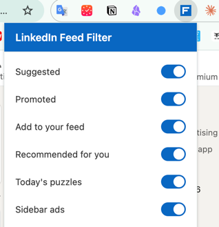
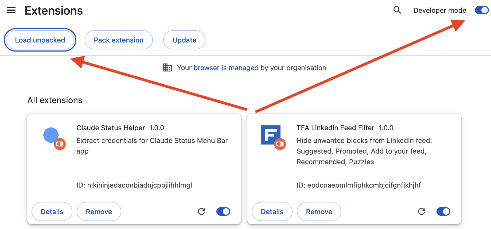

# TFA LinkedIn Feed Filter

A Chrome extension that hides unwanted content from your LinkedIn feed — Suggested posts, Promoted content, "Add to your feed" widgets, Recommended posts, Today's puzzles, and Sidebar ads.



## Installation

### 1. Clone the repository

```bash
git clone https://github.com/ilinevgeny/tfa-linkedin-feed.git
cd tfa-linkedin-feed
```

Or download and extract the ZIP archive from the repository page.

### 2. Open Chrome Extensions page

Navigate to `chrome://extensions` in your browser's address bar.

### 3. Enable Developer mode and load the extension

Turn on the **Developer mode** toggle in the top-right corner, then click the **Load unpacked** button in the top-left corner.



### 4. Select the `src` folder

In the file picker dialog, navigate to the cloned repository and select the **`src`** folder.

The extension will appear in your extensions list and is ready to use.

## Usage

Click the extension icon in the Chrome toolbar to open the popup. Use the toggles to enable or disable filtering for each content type:

- **Suggested** — suggested posts in the feed
- **Promoted** — sponsored / promoted posts
- **Add to your feed** — sidebar "Add to your feed" suggestions
- **Recommended for you** — "Recommended for you" posts
- **Today's puzzles** — LinkedIn puzzle widgets
- **Sidebar ads** — advertisement iframes in the sidebar
